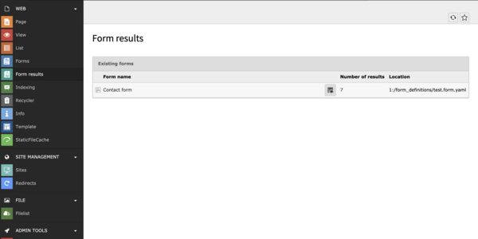
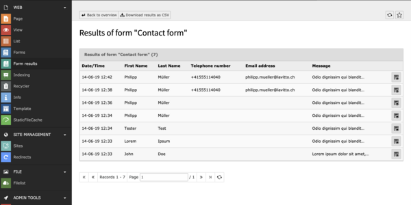

# TYPO3 Extension `Form to Database`

[](https://packagist.org/packages/liquidlight/typo3-form-to-database)
[](https://extensions.typo3.org/extension/form_to_database/)
[](https://packagist.org/packages/liquidlight/typo3-form-to-database)

> This extension adds an additional finisher to the TYPO3 Form (tx_form) to save the results into the database

- **GitHub Repository**: [github.com/liquidlight/typo3-form-to-database](https://github.com/liquidlight/typo3-form-to-database)
- **TYPO3 Extension Repository**: [extensions.typo3.org/extension/form_to_database](https://extensions.typo3.org/extension/form_to_database)
- **Found an issue?**: [github.com/liquidlight/typo3-form-to-database/issues](https://github.com/liquidlight/typo3-form-to-database/issues)

```code
composer req liquidlight/typo3-form-to-database
```

## Compatibility

| Form to Database | TYPO3 Version |
| ---------------- | ------------- |
| 5.x              | 13.4          |
| 4.x              | 12.4          |
| 3.x              | 11.5          |
| 2.x              | 9.5 - 10.4    |

## Introduction

### Features

- No configuration needed
- No database-changes per form required
- Shows all results per form in a separate backend module
- Provides a CSV-download of all results
- Preview & PDF download of individual form results
- Automatic deletion of results after a specified number of days (GDPR)

### Screenshots

#### Backend Overview


- [Full Size Screenshot](Documentation/Images/typo3-form-to-database-backend-overview.png)

#### Backend Results


- [Full Size Screenshot](Documentation/Images/typo3-form-to-database-backend-results.png)

## Installation & setup

1. `composer req liquidlight/typo3-form-to-database` (or download from the [TYPO3 Extension Repository](https://extensions.typo3.org/extension/form_to_database))
2. Add the extension as a dependency in your site as a site set
3. Edit the form you wish to store results for
4. Add the finisher ("Save the mail to the Database") to your form - it is recommended you place this finisher first

The recommended way to install the extension is by using [Composer](https://getcomposer.org/). In your Composer based
TYPO3 project root run `composer req liquidlight/typo3-form-to-database`.

### Installation from TYPO3 Extension Repository (TER)

Download and install the extension `form_to_database` with the extension manager module.

## Setup & Usage

### Finisher

To start storing form results:

1. Install the extension
2. Edit the form you wish to store results for
3. Add the finisher ("Save the mail to the Database") to your form - it is recommended you place this finisher first

### Command / Scheduler

It's possible to delete the form results by the command line or scheduler (Execute console commands).

```shell script
Usage:
  form_to_database:deleteFormResults [<maxAge>]

Arguments:
  maxAge                Maximum age of form results in days [default: 90]
```

### Options

There are several options available for customisation. To change these, go to **Settings** -> **Configure Extensions** -> **form_to_database**

- **General**
  - `hideLocationInList` - Should the location of the form be hidden on the Form results overview module? (Default: No)
  - `displayActiveFieldsOnly` - If true will only output active renderables in backendModule and CSV (will not display deleted renderables stored in the formDefinition) (Default: false)
- **CSV Settings**
  - `csvDelimiter` - What character should separate fields in the CSV export (Default: `,`)
  - `csvOnlyFilenameOfUploadFields` - Should the CSV list the whole path or just the file name?
  - `csvHtmlSpecialChars` - If true will encode special chars (`'` => `&quot;`, `<` => `&lt;`) (Default: true)

### Additional Feature configuration

#### PDF download of a single result

<details>
    <summary>Details</summary>

Each form response can be downloaded as a PDF which can be customised in TypoScript if [mPDF](https://mpdf.github.io/) is installed.

TO utilise this feature, install mPDF as an additional dependency

```
composer req mpdf/mpdf
```

Settings can be directly passed in to mPDF by using

```
module.tx_formtodatabase_web_formtodatabaseformresults.settings.pdf.config
```

The defaults are the following, however they can be overwritten:

```
'default_font_size' => '12',
'format' => 'A4',
'orientation' => 'P',
'margin_left' => '15',
'margin_right' => '15',
'margin_bottom' => '15',
'margin_top' => '15',
'tempDir' => Environment::getVarPath() . '/form_to_database'
```

##### Stylesheets

If you wish to pass in a custom CSS stylesheet, you can do so with the following:

```
module.tx_formtodatabase_web_formtodatabaseformresults.settings.pdf.stylesheet {
  link = EXT:your_extension/Resources/Public/Css/print-form-to-database.css
  media = all
}
```

##### Letterheads

Letterheads can add information to the top and bottom of each page, it uses [SetHTMLHeader](https://mpdf.github.io/reference/mpdf-functions/sethtmlheader.html) and [SetHTMLFooter](https://mpdf.github.io/reference/mpdf-functions/sethtmlfooter.html) directly.

This means all the mPDF variables are accessible. These can be added via TypoScript (`letterheads.header` and `letterheads.footer`). For example:

```
module.tx_formtodatabase_web_formtodatabaseformresults.settings.pdf.letterheads.footer (
  <table class="footer"><tr><td>Form to Database - {PAGENO}/{nbpg}</td></tr></table>
)
```

</details>

## Contribute

We welcome issues and merge/pull requests. Please don't let conventions or failing tests put you off - we can always fix them once a request is submitted.

Please create an issue at https://github.com/liquidlight/typo3-form-to-database/issues.

Please follow the [TYPO3 Commit conventions](https://docs.typo3.org/m/typo3/guide-contributionworkflow/main/en-us/Appendix/CommitMessage.html) if you can when committing.

**Please use GitLab only for bug-reporting or feature-requests. For support use the [TYPO3 community channels](https://typo3.slack.com/archives/C02HWBCUF0F)**

**To run tests & linting**

The extension uses a modified version of runTests.sh from [the TYPO3 core](https://docs.typo3.org/m/typo3/guide-contributionworkflow/main/en-us/Testing/Index.html).

You need [Podman](https://podman.io/) installed and running to run the tests.

- Install dependencies with TYPO3 13 and php 8.2:
  - `Build/Scripts/runTests.sh -t 13 -p 8.2 -s composer install` (-t is currently obsolete, as only v13 is supported and set as default)
- Run linter:
  - `Build/Scripts/runTests.sh -p 8.2 -s lintPhp`
  - `Build/Scripts/runTests.sh -t 13 -p 8.2 -s lintTypoScript`
- Execute functional tests:
  - `Build/Scripts/runTests.sh -p 8.2 -s functional`

See help menu for all options: `Build/Scripts/runTests.sh --help`

Commits should follow [TYPO3 Commit Guidelines](https://docs.typo3.org/m/typo3/guide-contributionworkflow/main/en-us/Appendix/CommitMessage.html#commitmessage).

## Releasing

The package is released automatically to [Packagist](https://packagist.org/packages/liquidlight/typo3-form-to-database) when tagged, however TER requires a manual upload

1. `git archive -o "form_to_database_[tag].zip" [tag]` where `[tag]` is the version just created
2. Upload the zip file created to the TER - use the changelog for the entry

## Support

If you need private or personal support, try the TYPO3 Slack channel - [#ext-form-to-database](https://app.slack.com/client/T024TUMLZ/C02HWBCUF0F) or contact us by email on [info@liquidlight.co.uk](mailto:info@liquidlight.co.uk).

**Be aware that this support might not be free!**

## Contributors

Big thanks to the following people

- ⭐️ [Philipp Mueller](https://www.lavitto.ch) - For providing the original code & extension
- Markus Hofmann
- Stig Nørgaard Færch
